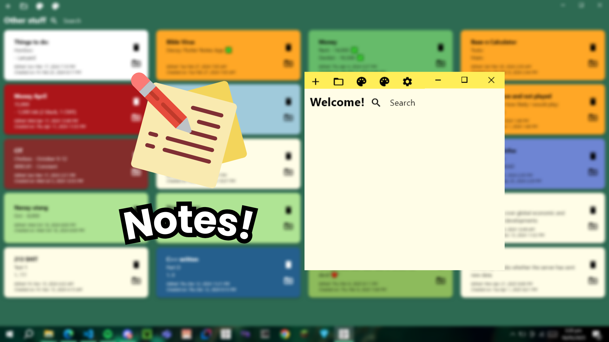

# 🍀 Notes! - A simple notes app 🍀

### A lightweight and stylish **text-only** app, Notes! is a great alternative if you are looking for a straightforward approach.

## 💾 Installation
- Click on the latest release found on the right side of this repository.
- Download the **Notes!-installer.exe** and run the setup, it is simple and shouldn't take long.

## ✨Features!

### 🎨 Colors
- Choose from 10 predefined colors
- Too bland? Click on the **Custom Color** button to edit the **HSV** values to your liking!
- Want even more options? Maximize the screen to show the **Color Wheel, RGB, HSV, HSL, and HEX value**
- Dark mode? Notes! automatically sets the font and icons to black or white depending on the brightness of your chosen color!

### 📂 Folders
- Want to group notes? No problem. Just click on the folder icon and create a folder, then move the notes to that folder. Easy!

### 🔄 Reordering
- Newly added notes always get added to the bottom, but don't worry, as Notes! allows you to reorder your notes!
- Simply click and drag your notes to arrange them in the perfect sequence.
  
### ⚙️ Additional Settings
When you decide to make Notes! app your daily driver, there's a few more options you want to look at.
- **Stay On Top Toggle:** This keeps the window always on top of other applications, helping you focus on creating your notes.
- **Ask Before Deleting:** This allows you to delete notes without having to confirm your decision, increasing your productivity.

### 🚀 Tech Stack and Developers
The app is written in **Dart** using the **Flutter** framework with **Visual Studio Code** as the editor and compiled using **Inno Compiler**. 

### 💪 Developer
Built by yours truly 😌🍀
